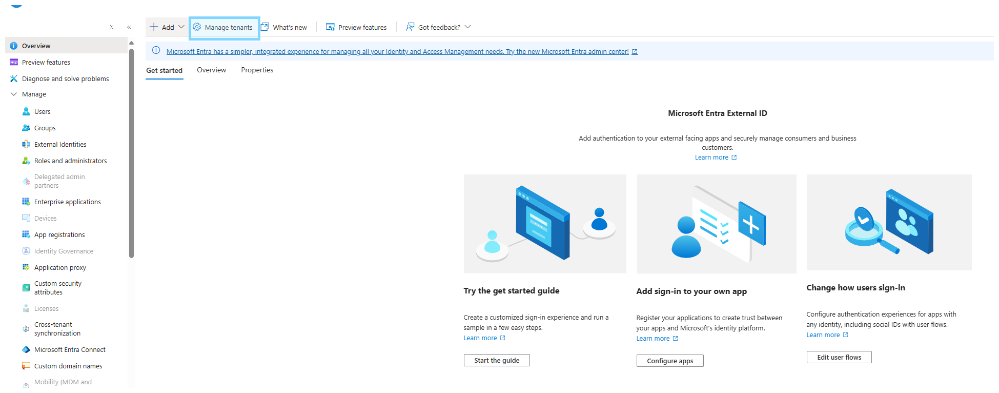
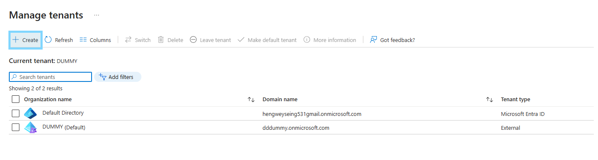
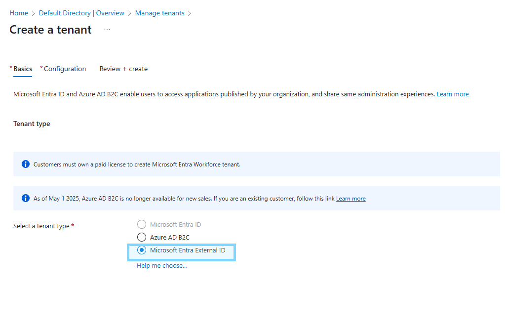
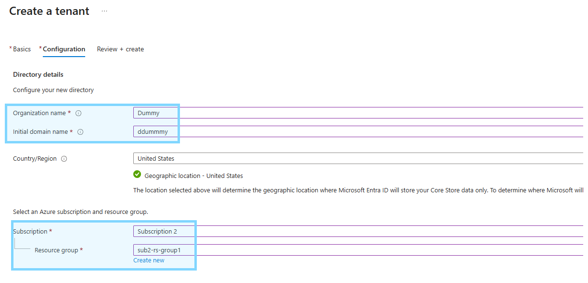
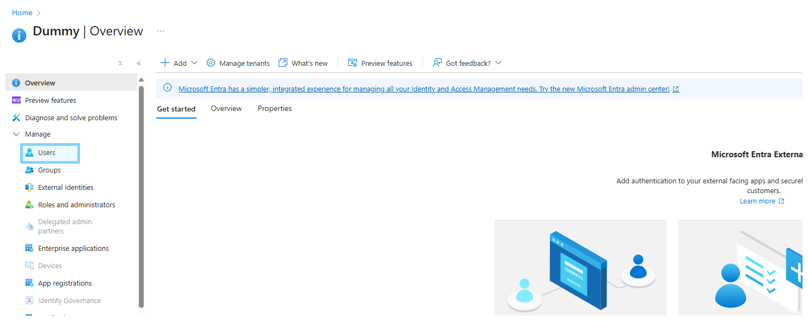
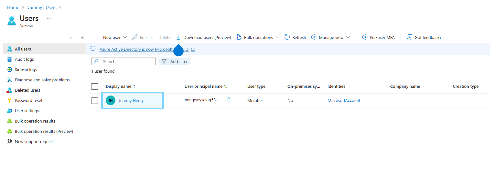
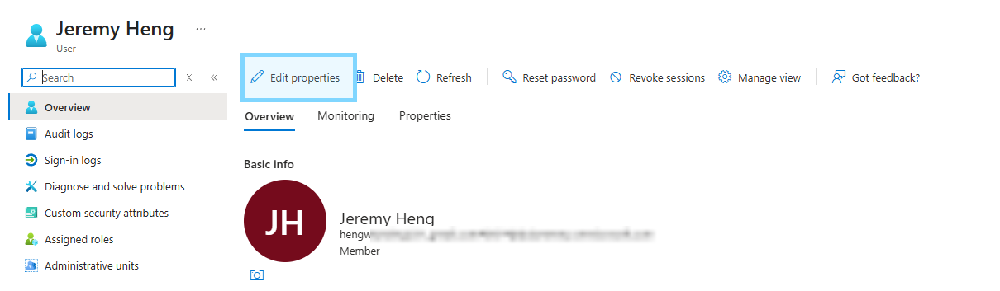
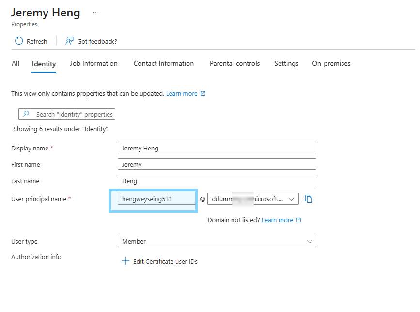

# Setup Subscription
- **Create a subcription plan**

# App Registrations

- **Register new app via `App Registrations`**

# Create API Secret key
- Go to `App Resgistrations` > `<Your App>` > `Certificates & secrets`

- **Record info below for later**
    - **App (Client) ID** as the Bot ID in Teams manifest.
    - **Client secret** for bot authentication or Graph API calls.

# Create Azure Bot
- **Go to `All Resources` > `AI Apps and Agents` > `Azure Bot`**

- **Use `App ID` and `Tenant ID` from `App Registrations`**

- **Configure messaging endpoint**

- **Add MS Teams as Channel**

# Create Tenant

- **Go to `Entra ID` > `Manage Tenants`**

- **Update current user email**

# Create MS Teams App

- **Go to https://dev.teams.microsoft.com/**
- **Login using EntraID user email**
- **Reset password if needed**

