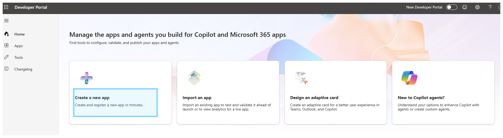
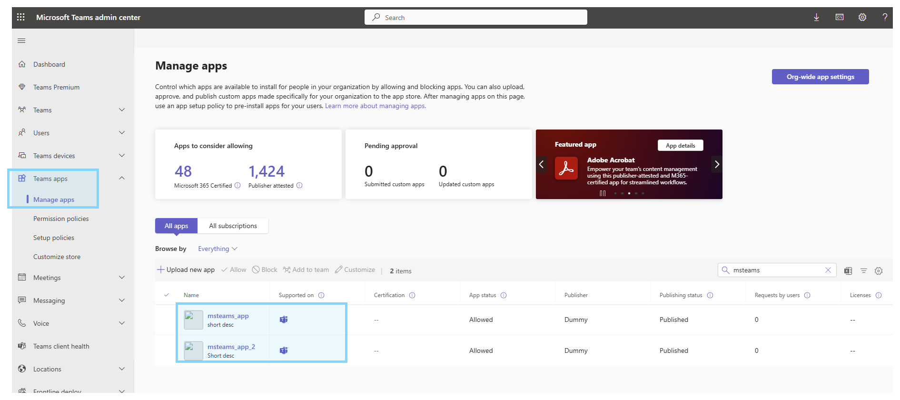

# Setup Subscription & Resource Group
- **Create a subcription plan**

- **Create Resource Group**

# Entra App Registrations

- **Register new app via `App Registrations`**

# Create API Secret key
- Go to `App Resgistrations` > `<Your App>` > `Certificates & secrets`

- **Record info below for later**
    - **App (Client) ID** as the Bot ID in Teams manifest.
    - **Client secret** for bot authentication or Graph API calls.

# Create Azure Bot
- **Go to `All Resources` > `AI Apps and Agents` > `Azure Bot`**

- **Use `App ID` and `Tenant ID` from `App Registrations`**

- **Configure messaging endpoint**

- **Add MS Teams as Channel**

# Create Work-Email User (Global admin)

- **Go to `Entra ID` > `Users`**

# Microsoft 365 Business Premium License
- **Access to https://admin.microsoft.com**
- **Purchase Microsoft 365 Business Premium License via 1-Month trial**

- **Grant license to user**

# Create MS Teams App

- **Go to https://dev.teams.microsoft.com/**
- **Login using EntraID user email**

- **Create new app**

- **Refer to `Azure` > `App Registrations` > `<YOUR_APP>` > `Client ID` for The Client ID below**

- **Create Bot in `App features`**

- **Refer to `Azure` > `App Registrations` > `<YOUR_APP>` > `Client ID` for The Bot ID below**

- **Set Permissions**

- **Publish app**

# Admin App Approval
- **Access to https://admin.teams.microsoft.com**
- **Must use Global Admin user to login and approve**

# Install MS Teams App
- **Login MS Teams App to install**

# Messaging Endpoint
- **Start up this docker container** via `docker compose up -d`
- **Expose to public network via** `ssh -R 80:localhost:5000 serveo.net`

- **Update Messaging Endpoint in `Azure Bot`**

